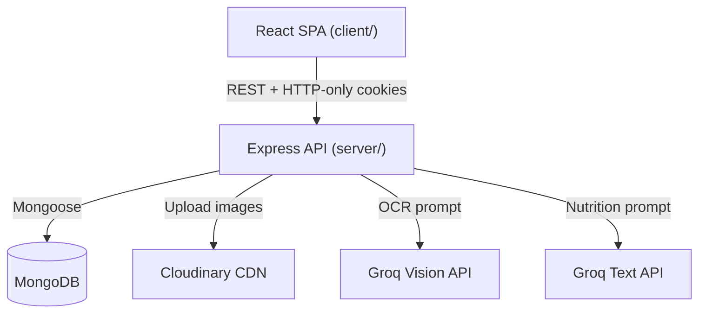
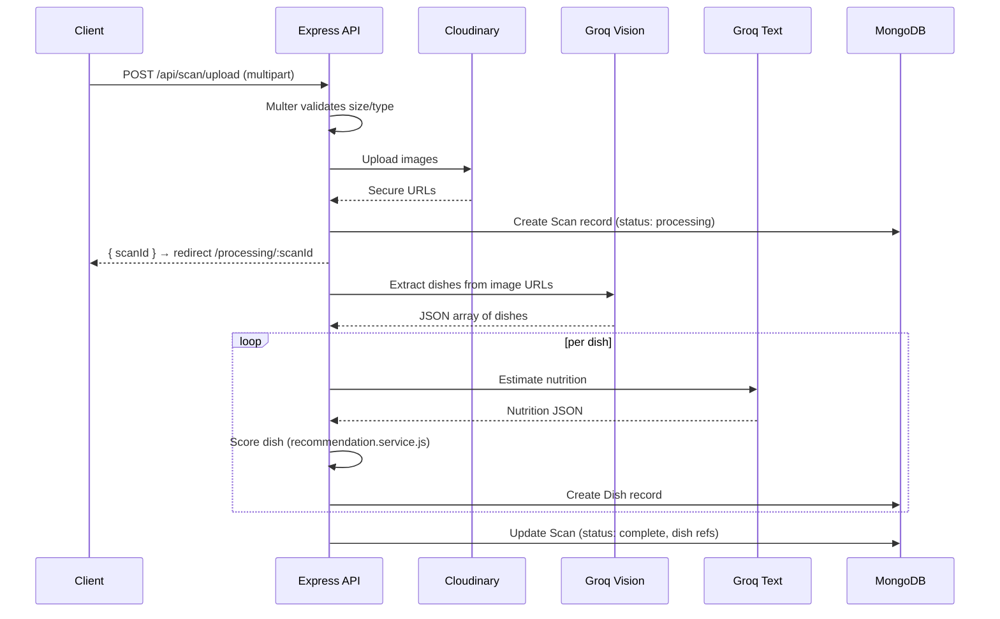
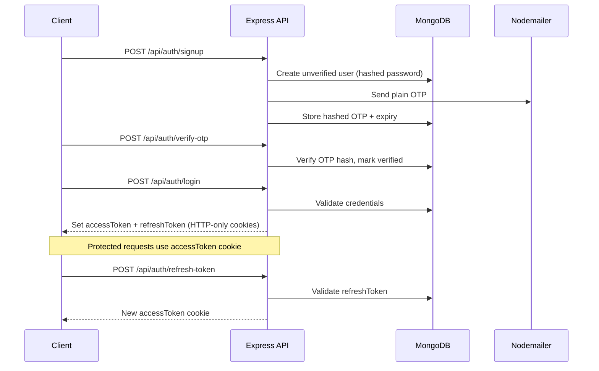

# Design Document — MenuLens

## Overview

MenuLens is a mobile-first MERN web application that lets users photograph restaurant menus and receive AI-powered, personalized meal recommendations. The system chains together image upload, Groq Vision OCR, Groq text-based nutrition estimation, and a rule-based scoring engine to produce ranked dish recommendations tailored to each user's health profile.

The architecture follows a classic client-server split:
- **client/** — React 18 + Vite SPA, Tailwind CSS, React Router v6
- **server/** — Express.js REST API, MongoDB via Mongoose, JWT auth, Groq SDK

The critical path for every scan is: `upload → Cloudinary → Groq Vision → Groq Nutrition → Score → Store → Respond`. All AI calls are server-side; the client only polls for status and renders results.

---

## Architecture



### Request Lifecycle — Scan Upload



> The scan upload endpoint responds immediately with `scanId` after Cloudinary upload. The AI pipeline runs asynchronously and the client polls `/api/scan/:scanId` for status updates.

### Authentication Flow



---

## Components and Interfaces

### Backend Services

#### `groq.service.js`
```
extractDishes(imageUrls: string[]) → Promise<RawDish[]>
  - Calls Groq Vision API with extraction prompt
  - Returns parsed JSON array or [] on failure
  - Retries once after 2s on network/API error

estimateNutrition(dish: { name, description }) → Promise<NutritionEstimate | null>
  - Calls Groq text API with nutrition prompt
  - Returns parsed nutrition object or null on failure
```

#### `nutrition.service.js`
```
processDishNutrition(rawDish, groqResult) → DishNutritionData
  - Computes avg from min/max for each macro
  - Sets confidenceScore; flags low confidence (< 40)
```

#### `recommendation.service.js`
```
scoreDish(dish, userProfile) → number (0–100)
  - Applies goal scoring, allergen hard-block, diet penalties, cooking method bonus
  - Clamps result to [0, 100]

generateTags(dish, score) → string[]
  - Returns array of descriptive tag strings

classifyDish(dish) → 'recommended' | 'avoid' | 'neutral'
  - score >= 60 → recommended
  - allergenFlags.length > 0 || score <= 30 → avoid
  - else → neutral
```

#### `auth.controller.js`
```
signup(req, res)       — validate → hash password → create user → send OTP
verifyOtp(req, res)    — compare OTP hash → mark verified → clear OTP
login(req, res)        — verify credentials → issue tokens → set cookies
logout(req, res)       — clear cookies → delete refreshToken from DB
refreshToken(req, res) — validate refresh cookie → issue new accessToken
resendOtp(req, res)    — rate-limited → regenerate OTP → send email
```

#### `scan.controller.js`
```
uploadScan(req, res)   — Multer → Cloudinary → create Scan → trigger AI pipeline → return scanId
getScan(req, res)      — fetch Scan + populated Dish refs
getHistory(req, res)   — paginated scan list for user
toggleSave(req, res)   — flip isSaved on Scan
deleteScan(req, res)   — delete Scan + all Dish records
```

### Frontend Components

#### `ProtectedRoute.jsx`
```jsx
// Guards all protected routes
// loading → <LoadingScreen />
// !user → <Navigate to="/login" />
// !user.onboardingComplete → <Navigate to="/onboarding/goal" />
// else → children
```

#### `AuthContext.jsx`
```javascript
// State: { user, loading }
// Actions: login(userData), logout(), updateUser(partial)
// On mount: GET /api/user/profile to rehydrate from cookie
```

#### `ScanContext.jsx`
```javascript
// State: { scanId, images, status, results }
// status: 'idle' | 'uploading' | 'processing' | 'done' | 'error'
// Actions: startScan(files), pollStatus(scanId), clearScan()
```

#### `api.js` (Axios instance)
```javascript
// baseURL: VITE_API_BASE_URL
// withCredentials: true (sends cookies)
// Response interceptor: on 401 → attempt /refresh-token → retry original request
// On refresh failure → redirect to /login
```

### API Contract Summary

| Method | Path | Auth | Description |
|--------|------|------|-------------|
| POST | /api/auth/signup | No | Register user |
| POST | /api/auth/verify-otp | No | Verify OTP |
| POST | /api/auth/login | No | Login, set cookies |
| POST | /api/auth/logout | Yes | Clear cookies |
| POST | /api/auth/refresh-token | Cookie | Refresh access token |
| POST | /api/auth/resend-otp | No | Resend OTP (rate limited) |
| GET | /api/user/profile | Yes | Get profile |
| PUT | /api/user/profile | Yes | Update profile |
| PUT | /api/user/onboarding | Yes | Save onboarding data |
| DELETE | /api/user/account | Yes | Delete account |
| POST | /api/scan/upload | Yes | Upload + trigger AI |
| GET | /api/scan/history | Yes | Paginated history |
| GET | /api/scan/:scanId | Yes | Single scan + dishes |
| PUT | /api/scan/:scanId/save | Yes | Toggle save |
| DELETE | /api/scan/:scanId | Yes | Delete scan |
| GET | /api/dish/:dishId | Yes | Dish detail |

---

## Data Models

### User
```javascript
{
  name: String,
  email: { type: String, unique: true, lowercase: true, trim: true },
  password: String,                    // bcrypt hash, saltRounds >= 10
  isVerified: { type: Boolean, default: false },
  otp: String,                         // bcrypt hash of OTP
  otpExpiry: Date,
  onboardingComplete: { type: Boolean, default: false },
  profile: {
    goal: { type: String, enum: ['lose_weight', 'build_muscle', 'stay_healthy'] },
    dietType: [{ type: String, enum: ['vegetarian','vegan','non_vegetarian','dairy_free','gluten_free','keto'] }],
    allergies: [{ type: String, enum: ['peanuts','shellfish','dairy','gluten','eggs','fish','tree_nuts','soy','none'] }],
    dailyCalories: { type: Number, default: 2000, min: 1000, max: 5000 },
    macros: {
      protein: { type: Number, default: 30 },
      carbs:   { type: Number, default: 45 },
      fat:     { type: Number, default: 25 }
    }
  },
  refreshToken: String,
  createdAt: { type: Date, default: Date.now }
}
```

### Scan
```javascript
{
  userId: { type: ObjectId, ref: 'User', required: true, index: true },
  restaurantName: String,
  images: [String],                    // Cloudinary secure URLs
  imageHashes: [String],               // MD5/SHA256 of original files for dedup
  rawExtractedText: String,
  status: { type: String, enum: ['processing','complete','failed'], default: 'processing' },
  errorMessage: String,
  dishes: [{ type: ObjectId, ref: 'Dish' }],
  recommendedDishes: [{ type: ObjectId, ref: 'Dish' }],
  avoidDishes: [{ type: ObjectId, ref: 'Dish' }],
  totalDishesFound: { type: Number, default: 0 },
  totalMatchingDishes: { type: Number, default: 0 },
  totalFlaggedDishes: { type: Number, default: 0 },
  isSaved: { type: Boolean, default: false },
  createdAt: { type: Date, default: Date.now }
}
```

### Dish
```javascript
{
  scanId: { type: ObjectId, ref: 'Scan', required: true, index: true },
  name: String,
  description: String,
  estimatedNutrition: {
    calories: { min: Number, max: Number, avg: Number },
    protein:  { min: Number, max: Number, avg: Number },
    carbs:    { min: Number, max: Number, avg: Number },
    fat:      { min: Number, max: Number, avg: Number },
    fiber: Number,
    sugar: Number
  },
  confidenceScore: { type: Number, default: 0, min: 0, max: 100 },
  matchScore:      { type: Number, default: 0, min: 0, max: 100 },
  tags: [String],
  allergenFlags: [String],
  avoidReasons: [String],
  recommendReason: String,
  cookingMethod: { type: String, enum: ['grilled','fried','steamed','baked','raw','unknown'], default: 'unknown' },
  estimatedPrice: Number,
  createdAt: { type: Date, default: Date.now }
}
```

### Key Design Decisions

- **`status` field on Scan**: The README omitted this but it's required for the polling pattern. The client polls `GET /api/scan/:scanId` and checks `scan.status` to know when to leave `/processing/:scanId`.
- **`imageHashes` on Scan**: Enables the deduplication requirement (Req 6.6) — before calling Groq Vision, the server checks if any hash matches a prior scan for the same user.
- **`errorMessage` on Scan**: Stores the failure reason when `status === 'failed'` so the client can display a meaningful retry message.

---


## Correctness Properties

*A property is a characteristic or behavior that should hold true across all valid executions of a system — essentially, a formal statement about what the system should do. Properties serve as the bridge between human-readable specifications and machine-verifiable correctness guarantees.*

**Property Reflection:** Before listing properties, redundancies were eliminated:
- Requirements 1.5 and 15.2 (no plain-text storage) are subsumed by Properties 1 and 2 which already verify hashing.
- Requirements 3.2 (refreshToken stored in DB) is subsumed by Property 6 (login issues tokens).
- Requirements 8.2–8.9 (individual scoring rules) are consolidated into Property 10 (scoring rules) and Property 11 (score clamping) to avoid enumerating each rule separately.
- Requirements 9.2–9.8 (individual tag rules) are consolidated into Property 12 (tag generation).
- Requirements 10.1–10.3 (result sections) are consolidated into Property 13 (results partitioning).
- Requirements 13.1 and 13.2 are consolidated into Property 17 (profile round-trip).

---

### Property 1: Password is never stored in plain text

*For any* valid signup input (name, email, password), the stored user record's `password` field SHALL NOT equal the original plain-text password, and SHALL be a valid bcrypt hash.

**Validates: Requirements 1.1, 1.5, 15.1**

---

### Property 2: OTP is stored as a bcrypt hash with a future expiry

*For any* user signup, the stored `otp` field SHALL be a valid bcrypt hash of the original 6-digit OTP, and `otpExpiry` SHALL be a timestamp between `now` and `now + 10 minutes`.

**Validates: Requirements 1.2, 1.5, 15.2**

---

### Property 3: Short passwords are always rejected

*For any* password string of length less than 8 characters, the signup endpoint SHALL return a 400 error response and SHALL NOT create a user record.

**Validates: Requirements 1.4**

---

### Property 4: OTP verification is a correct round-trip

*For any* user with a valid stored OTP hash and a non-expired `otpExpiry`, submitting the correct plain-text OTP SHALL result in `isVerified === true`, and both `otp` and `otpExpiry` SHALL be cleared from the record.

**Validates: Requirements 2.1**

---

### Property 5: Wrong OTPs are always rejected

*For any* string that does not match the stored OTP hash, the verify-otp endpoint SHALL return a 400 error and SHALL NOT mark the account as verified.

**Validates: Requirements 2.2**

---

### Property 6: Login issues HTTP-only cookies and stores refresh token

*For any* verified user with correct credentials, the login endpoint SHALL set both `accessToken` and `refreshToken` as HTTP-only cookies, and the `refreshToken` SHALL be stored in the user's database record.

**Validates: Requirements 3.1, 3.2**

---

### Property 7: Wrong credentials always return 401 without field disclosure

*For any* login request with an incorrect email or password, the response SHALL be a 401 error, and the response body SHALL NOT indicate which specific field (email or password) was incorrect.

**Validates: Requirements 3.4**

---

### Property 8: Logout clears cookies and removes refresh token from DB

*For any* logged-in user, calling the logout endpoint SHALL clear both HTTP-only cookies and set `refreshToken` to null in the user's database record.

**Validates: Requirements 3.7**

---

### Property 9: Onboarding data persists correctly as a round-trip

*For any* valid onboarding payload (goal, dietType, allergies, dailyCalories), after submitting the final onboarding step, fetching the user profile SHALL return data matching the submitted values and `onboardingComplete` SHALL be `true`.

**Validates: Requirements 4.2, 4.3, 4.4, 4.5, 4.6**

---

### Property 10: Upload file count boundary is enforced

*For any* upload request with 0 files or more than 3 files, the Scan_Service SHALL return a 400 error. *For any* upload request with 1, 2, or 3 files, the request SHALL be accepted (assuming valid type and size).

**Validates: Requirements 5.1**

---

### Property 11: File size limit is enforced at the boundary

*For any* image file exceeding 5 MB, the Scan_Service SHALL return a 400 error. *For any* image file at or below 5 MB with a valid MIME type, the size check SHALL pass.

**Validates: Requirements 5.2**

---

### Property 12: Only allowed MIME types are accepted

*For any* file with a MIME type other than `image/jpeg`, `image/png`, or `image/webp`, the Scan_Service SHALL return a 400 error. *For any* file with one of those three MIME types, the type check SHALL pass.

**Validates: Requirements 5.3**

---

### Property 13: Scan upload creates a retrievable Scan record

*For any* valid upload request, the returned `scanId` SHALL resolve to a Scan record via `GET /api/scan/:scanId`, and that record SHALL reference the uploaded image URLs.

**Validates: Requirements 5.6**

---

### Property 14: Groq Vision response is fully persisted as Dish records

*For any* valid Groq Vision JSON response containing N dish objects, exactly N Dish records SHALL be created in the database, each containing the name, description, and price from the response.

**Validates: Requirements 6.2**

---

### Property 15: Duplicate image hash reuses existing dishes

*For any* image whose hash already exists in a prior Scan for the same user, re-uploading that image SHALL NOT trigger a new Groq Vision API call and SHALL reuse the previously extracted Dish records.

**Validates: Requirements 6.6**

---

### Property 16: Nutrition avg is always (min + max) / 2

*For any* Groq nutrition response with `min` and `max` values for a macro, the stored `avg` field SHALL equal `(min + max) / 2`.

**Validates: Requirements 7.2**

---

### Property 17: Low-confidence dishes are flagged

*For any* dish with a `confidenceScore` below 40, the dish detail rendering SHALL include a low-confidence warning indicator.

**Validates: Requirements 7.4**

---

### Property 18: Match_Score is always clamped to [0, 100]

*For any* dish and *any* user health profile combination, `scoreDish(dish, userProfile)` SHALL return an integer in the range [0, 100] inclusive.

**Validates: Requirements 8.1, 8.10**

---

### Property 19: Allergen match hard-blocks the score to 0

*For any* dish whose detected ingredients contain an allergen present in the user's allergies list, `scoreDish()` SHALL return exactly 0, regardless of any other scoring factors.

**Validates: Requirements 8.5**

---

### Property 20: Tag generation is consistent with nutrition thresholds

*For any* dish, `generateTags(dish, score)` SHALL assign exactly the tags whose threshold conditions are met: `High Protein` iff protein.avg >= 25, `Low Carb` iff carbs.avg <= 20, `Low Calorie` iff calories.avg <= 400, `High Calorie` iff calories.avg >= 700, `Healthy Cook` iff cookingMethod in {grilled, steamed, baked}, `Deep Fried` iff cookingMethod === 'fried', `Fits Your Goal` iff score >= 80.

**Validates: Requirements 9.1–9.8**

---

### Property 21: Results sections form a complete partition of all dishes

*For any* list of scored dishes, the Recommended (score >= 60), Avoid (allergenFlags or score <= 30), and All Dishes (remaining) sections SHALL together contain every dish exactly once, with no dish appearing in more than one section.

**Validates: Requirements 10.1, 10.2, 10.3**

---

### Property 22: Scan history is sorted by creation date descending

*For any* user with multiple scans, `GET /api/scan/history` SHALL return scans ordered by `createdAt` descending, with no scan appearing out of order.

**Validates: Requirements 12.1**

---

### Property 23: Save toggle is idempotent over two applications

*For any* scan, toggling `isSaved` twice SHALL return the scan to its original `isSaved` state.

**Validates: Requirements 12.4**

---

### Property 24: Scan deletion cascades to all associated Dish records

*For any* scan with associated Dish records, after `DELETE /api/scan/:scanId`, querying Dish records by `scanId` SHALL return an empty result.

**Validates: Requirements 12.5**

---

### Property 25: Profile update is a correct round-trip

*For any* valid profile update payload, after `PUT /api/user/profile`, `GET /api/user/profile` SHALL return data matching the submitted values.

**Validates: Requirements 13.1, 13.2**

---

### Property 26: Invalid enum values in profile update are rejected

*For any* profile update payload containing a `goal`, `dietType`, or `allergy` value not in the defined enums, the endpoint SHALL return a 400 error listing the invalid fields.

**Validates: Requirements 13.3**

---

### Property 27: Account deletion cascades to all user data

*For any* user with associated Scan and Dish records, after `DELETE /api/user/account`, querying Scans and Dishes by `userId` or `scanId` SHALL return empty results, and both auth cookies SHALL be cleared.

**Validates: Requirements 13.4**

---

## Error Handling

### AI Pipeline Failures

| Failure | Behavior |
|---------|----------|
| Groq Vision network error | Retry once after 2s; on second failure set `scan.status = 'failed'` with `errorMessage` |
| Groq Vision returns invalid JSON | Log raw response server-side; record 0 dishes for that image; continue |
| Groq Vision returns empty array | Record 0 dishes; continue processing other images |
| Groq text API fails for a dish | Store `null` nutrition, `confidenceScore = 0`; continue to next dish |
| Groq text API returns invalid JSON | Log raw response; treat as failure for that dish |

The raw Groq response is **never** forwarded to the client. The client receives only a safe error message and the `scan.status` field.

### Auth Failures

| Failure | HTTP Status | Notes |
|---------|-------------|-------|
| Duplicate email on signup | 409 | |
| Invalid password length | 400 | |
| Wrong OTP | 400 | |
| Expired OTP | 400 | |
| Unverified account login | 403 | |
| Wrong credentials | 401 | No field disclosure |
| Expired/missing refresh token | 401 | Clear both cookies |

### Upload Failures

| Failure | HTTP Status |
|---------|-------------|
| 0 or > 3 files | 400 |
| File > 5 MB | 400 |
| Invalid MIME type | 400 |
| > 10 scans/day | 429 |
| Cloudinary upload failure | 500 with retry guidance |

### Frontend Error Handling

- Axios interceptor catches 401 responses, attempts token refresh, retries the original request once
- On refresh failure, clears local auth state and redirects to `/login`
- `react-hot-toast` displays user-facing error messages
- The Processing page polls `GET /api/scan/:scanId` every 3 seconds; on `status === 'failed'` it shows an error with a retry button

---

## Testing Strategy

### Dual Testing Approach

Unit tests cover specific examples, edge cases, and error conditions. Property-based tests verify universal properties across many generated inputs. Both are necessary for comprehensive coverage.

### Property-Based Testing

The recommendation engine (`scoreDish`, `generateTags`, `classifyDish`) and the nutrition computation (`avg = (min+max)/2`) are pure functions with large input spaces — ideal candidates for property-based testing.

**Library**: [fast-check](https://github.com/dubzzz/fast-check) (JavaScript/TypeScript)

**Configuration**: Minimum 100 runs per property test.

**Tag format**: Each property test is tagged with a comment:
```
// Feature: menulens, Property N: <property_text>
```

**Properties to implement as PBT**:

| Property | Test Focus |
|----------|-----------|
| 3 | Short password rejection |
| 10 | File count boundary |
| 11 | File size boundary |
| 12 | MIME type filtering |
| 16 | Nutrition avg computation |
| 18 | Score clamping [0, 100] |
| 19 | Allergen hard-block |
| 20 | Tag threshold consistency |
| 21 | Results partition completeness |
| 22 | History sort order |
| 23 | Save toggle idempotence |

### Unit Tests (Example-Based)

- Auth flow: signup → OTP → login → refresh → logout (happy path)
- Auth error cases: duplicate email, wrong OTP, expired OTP, unverified login, wrong credentials
- Onboarding routing: redirect to `/onboarding/goal` when incomplete, redirect to `/home` when complete
- Scan upload: Multer validation, Cloudinary mock, scanId returned
- Groq retry: first call fails, second succeeds
- Groq cascade failure: both calls fail → scan.status = 'failed'
- Dish detail rendering: all fields present, allergen disclaimer shown
- Results page: top 3 recommended prominent, dish card navigation
- History page: scan entry fields, navigation to results

### Integration Tests

- `POST /api/scan/upload` → Cloudinary → Groq Vision mock → Dish records created
- `GET /api/scan/history` → returns scans for correct user only
- `DELETE /api/user/account` → cascades to scans and dishes
- JWT cookie flags: verify `HttpOnly`, `Secure`, `SameSite=Strict` on Set-Cookie header

### Frontend Testing

- `ProtectedRoute` component: renders children when authenticated + onboarded; redirects otherwise
- `AuthContext`: rehydrates from cookie on mount; clears state on logout
- `ScanContext`: status transitions `idle → uploading → processing → done`
- Axios interceptor: 401 triggers refresh, retries request, redirects on refresh failure
